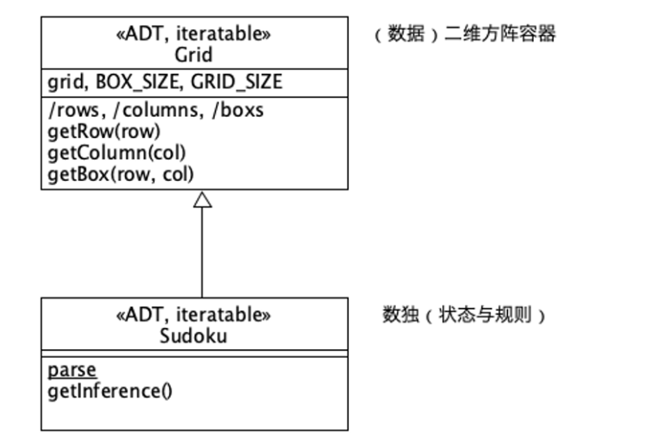
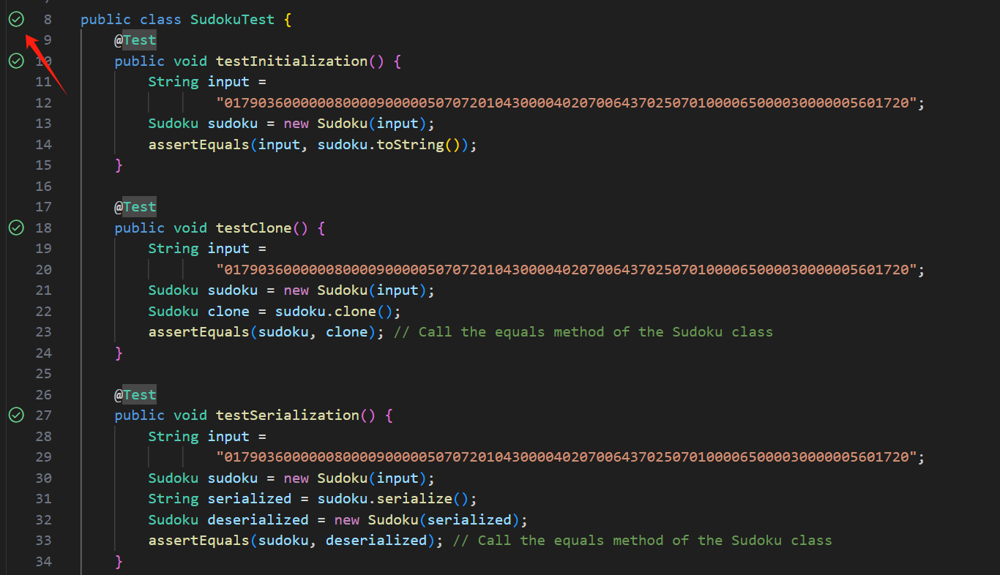

# Object-Oriented_technology_Wangqing
Implement Sudoku modules (business code, test code, documentation) as designed in two languages, one statically typed (C++ Java) and one dynamically typed (Python).

| 学号     | 姓名   |
| -------- | ------ |
| 24220069 | 吴承韦 |

---

## Requirement

按照自己喜好，分别用两种语言，一种静态类型（C++、Java、……），一种动态类型（Python、JavaScript、……），按设计实现Sudoku模块（业务代码、测试代码、文档）。    




**要求**

业务功能

Input：017903600000080000900000507072010430000402070064370250701000065000030000005601720 

更多测例，可从 https://www.sudokuwiki.org/ 获取

解析字符串输入，得到Sudoku实例

推理棋盘，得到各单元格候选值

场景下其它合理功能

代码质量

OO基础技术：实现的Sudoku类应当符合所用语言OOP的技术惯例，包括必要的基础技术方法，包括并不限于：**对象创建、初始化、克隆、串行化、外表化、比较（序）**

正确性：必要的测试代码和测试用例

可理解性：恰当的命名、合理的模块（函数）划分、必要的注释

制品提交

建立自己的Github账号，用于作业。本次作业作为一个独立、公开的代码仓库（repo）。

源码：直接在雨课堂作业中贴入源码与文档，多源文件可合并贴入。

项目（repo）：雨课堂作业中，给出repo对应branch或tag的URL。

---
**Sudoku类方法简介：**

构造函数：初始化数独棋盘

串行化：将数独棋盘序列化为一个字符串

外表化：将表示数独棋盘的字符串反序列化成一个数独对象

比较（序）：重写等于用于比较数独对象

查找候选数：根据在于数独上的位置推测出可以填写的数字

打印：打印数独

---

**java项目结构**

环境：java17、JUnit5

实现Sudoku：Sudoku.java

测试代码：SudokuTest.java

src
├── main
│   ├── java
│   │   └── com
│   │       └── example
│   │           ├── Main.java
│   │           └── Sudoku.java
└── test
    └── java
        └── com
            └── example
                └── SudokuTest.java


使用Junit进行测试



测试内容与结果

| 测试内容           | 结果 |
| ------------------ | ---- |
| testInitialization | 通过 |
| testClone          | 通过 |
| testSerialization  | 通过 |
| testGetCandidates  | 通过 |

---

**python项目结构**

环境：python3.9

src/
│   ├── main/
│   │   └── Sudoku.py
│   └── test/
│       └── SudokuTest.py

实现Sudoku：Sudoku.py

使用测试代码：SudokuTest.py


使用unittest进行测试

```python
python -u -m unittest src.test.SudokuTest > test_results.log 2>&1
```

测试内容与结果

| 测试内容            | 结果 |
| ------------------- | ---- |
| test_initialization | 通过 |
| test_clone          | 通过 |
| test_serialize      | 通过 |
| test_deserialize    | 通过 |
| test_getCandidates  | 通过 |

